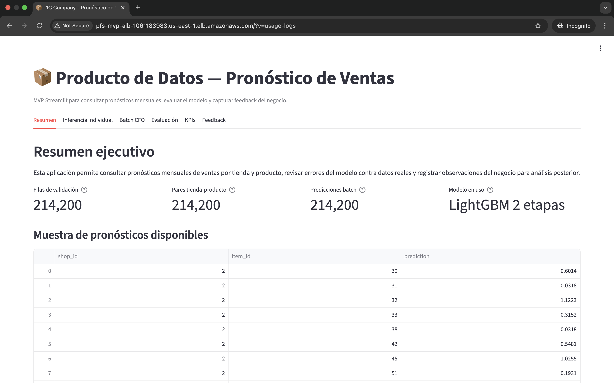
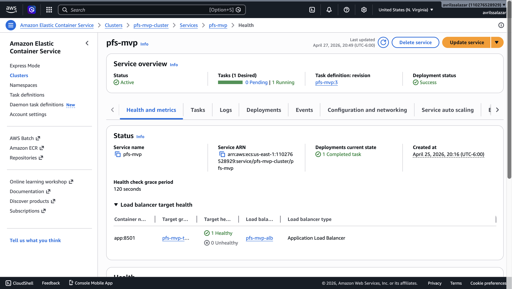
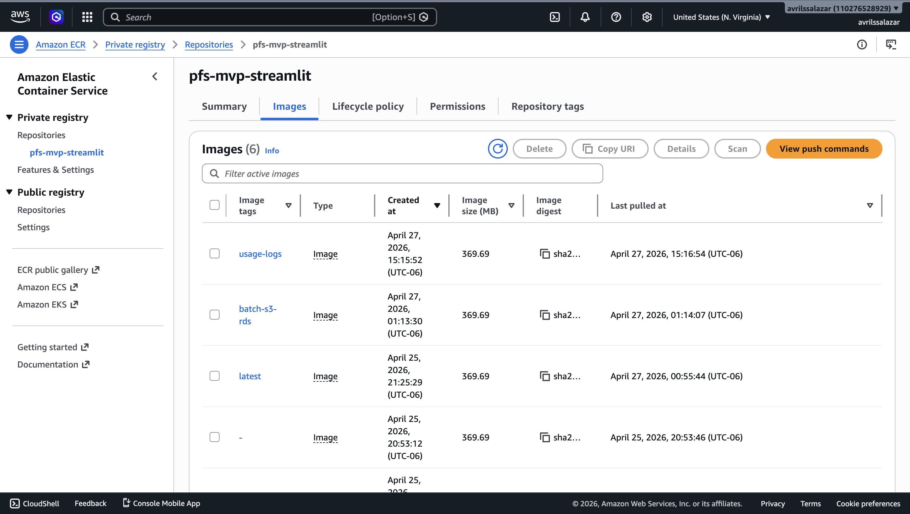
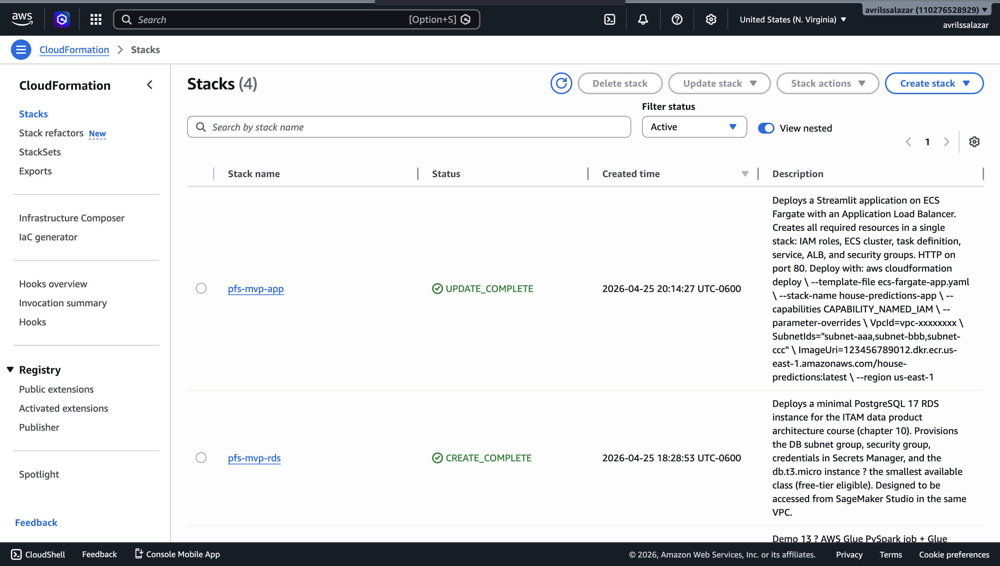
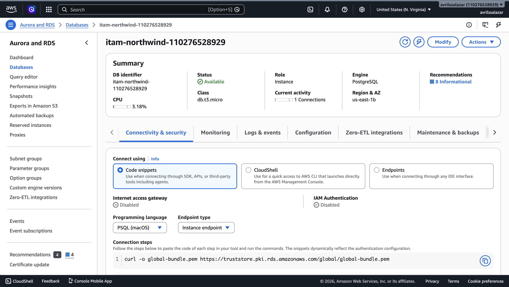
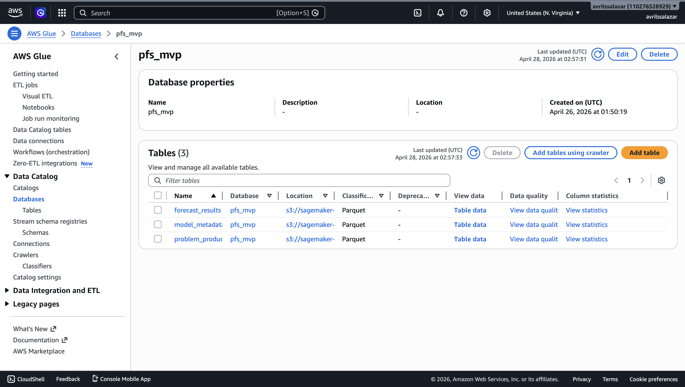
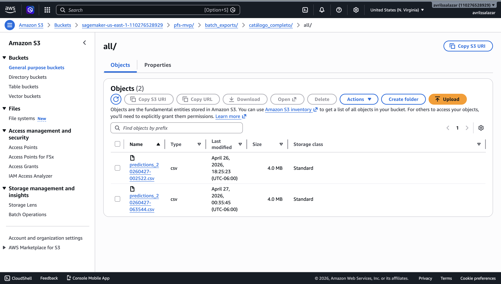

# Producto de Datos — Pronóstico de Ventas 1C Company

## Objetivo

Este proyecto implementa un MVP (Minimum Viable Product) de producto de datos para consultar pronósticos mensuales de ventas de 1C Company desde una aplicación web de Streamlit desplegada en AWS.

El objetivo principal es que el equipo de negocio no deba abrir notebooks ni entrar a SageMaker para consultar resultados. La aplicación permite ver predicciones, filtrar por tienda, generar archivos batch para el CFO, revisar métricas de evaluación del modelo y capturar feedback del negocio en una base de datos.

El MVP fue diseñado para responder a las necesidades de planeación de demanda, finanzas, BI, operaciones, ciberseguridad y machine learning. La solución prioriza una app estable, rápida y desplegada en una URL pública, usando servicios administrados de AWS para persistencia, despliegue, seguridad y observabilidad.

---

## URLs de ejecución

### Aplicación pública

```text
http://pfs-mvp-alb-1061183983.us-east-1.elb.amazonaws.com
```

### Repositorio

```text
https://github.com/avrilsalazarrodriguez/Parcial_ProductoDeDatos_MVP
```

---

## Estado actual del MVP

La aplicación ya está desplegada en AWS y corre sobre ECS Fargate. No depende de una laptop ni de una instancia local de Streamlit.

Actualmente el MVP permite:

- Consultar predicciones precomputadas para el mes siguiente;
- Filtrar pronósticos por tienda o catálogo completo;
- Ejecutar inferencia individual con el modelo serializado;
- Subir un archivo CSV compatible y generar predicciones;
- Generar un archivo CFO, descargarlo y guardarlo en S3;
- Registrar el historial del batch CFO en RDS;
- Capturar feedback de negocio en RDS;
- Listar productos problemáticos para revisión;
- Mostrar evaluación contra ground truth;
- Comparar el modelo contra un baseline naive;
- Ver KPIs de error por tienda y producto;
- Registrar eventos de uso de la app en RDS;
- Consultar logs técnicos en CloudWatch.

---

## Branch principal de trabajo

La integración final del MVP se encuentra en la rama:

```text
main
```

La rama donde se construyó y desplegó la aplicación pública fue:

```text
partial-mvp
```

La rama de ModelOps y reentrenamiento segmentado se integró desde:

```text
feature/modelops-segmented-retraining
```

---

## Arquitectura general

La solución separa la aplicación de usuario, la persistencia de datos y el flujo de actualización de modelos.

La app de Streamlit corre como contenedor en ECS Fargate. La imagen se almacena en ECR. La app lee predicciones y artefactos preparados, ejecuta inferencia individual con el modelo serializado y guarda datos operacionales en RDS. Los archivos generados para el CFO se guardan en S3.

Además, se dejó preparado un flujo ModelOps para que, cuando lleguen datos nuevos, el procesamiento pesado ocurra fuera de Streamlit. Ese flujo usa SageMaker Processing para generar features, entrenar modelos, evaluar resultados y publicar nuevas predicciones en S3, listas para ser consumidas por la app.

---

### Diagrama de arquitectura


Archivo editable:

```text
docs/architecture.drawio
```

Export:

```text
docs/images/architecture.png
```

---

## Servicios AWS utilizados

La solución usa servicios administrados de AWS para separar responsabilidades: la app se ejecuta en contenedores, los datos se guardan fuera del cómputo, las credenciales se administran de forma segura y los procesos pesados de actualización quedan fuera de Streamlit.

| Servicio | Uso dentro del MVP |
|---|---|
| **Amazon ECS Fargate** | Ejecuta la aplicación de Streamlit como contenedor. Se eligió Fargate porque permite correr la app sin administrar directamente una instancia EC2. Esto ayuda a que la aplicación siga viva aunque nadie tenga una laptop prendida. |
| **Amazon ECR** | Guarda la imagen Docker de la aplicación. Cada vez que se actualiza la app, se construye una nueva imagen, se sube a ECR y ECS la usa para desplegar la versión más reciente. |
| **Application Load Balancer** | Expone la aplicación mediante una URL pública y permite validar que la app esté respondiendo. |
| **Amazon S3** | Guarda archivos persistentes del MVP. En la app se usa para almacenar los archivos batch generados para el CFO. En el flujo ModelOps también se usa para guardar datos de entrada, features, modelos, métricas y predicciones generadas fuera de Streamlit. |
| **AWS Glue Data Catalog** | Registra tablas analíticas sobre datos en S3, como pronósticos, productos problemáticos y metadata del modelo. Esto deja preparada la información para consultas posteriores. |
| **Amazon RDS PostgreSQL** | Guarda datos operacionales que sí necesitan persistencia transaccional: feedback del negocio, historial de archivos batch generados y eventos de uso de la app. Esto evita guardar información importante dentro del contenedor de Streamlit. |
| **AWS Secrets Manager** | Guarda las credenciales de RDS. La app las lee en tiempo de ejecución, por lo que el usuario, contraseña y endpoint de la base no quedan escritos directamente en el código. |
| **AWS CloudFormation** | Define y despliega la infraestructura principal del MVP. Se usa para crear la capa persistente de RDS y la capa de aplicación en ECS Fargate, evitando configurar esos recursos manualmente desde la consola. |
| **Amazon CloudWatch** | Guarda logs técnicos de la aplicación y de los procesos de AWS. Esto permite revisar errores, warnings y comportamiento del sistema si algo falla. |
| **Amazon SageMaker Processing** | Forma parte del flujo ModelOps preparado para actualización futura. Se usa para ejecutar fuera de Streamlit el feature engineering, entrenamiento segmentado, evaluación y batch scoring cuando lleguen datos nuevos. |

Para este MVP no se usó **SageMaker Batch Transform** desde la app pública. La decisión fue mantener la experiencia rápida y estable: para grupos grandes se usan predicciones precomputadas y para casos pequeños se carga el modelo serializado dentro del contenedor con `@st.cache_resource`.

Esta decisión reduce latencia en la UI, evita que el usuario espere procesos largos desde Streamlit y permite que el cómputo pesado quede separado en el flujo ModelOps.

---

## Funcionalidades de la aplicación

La aplicación está organizada en seis vistas principales. Cada vista responde a una necesidad distinta del negocio: consulta rápida, inferencia, generación de archivos, evaluación del modelo, monitoreo de KPIs y captura de feedback.

### 1. Resumen

Esta vista funciona como entrada ejecutiva al producto de datos. Muestra una fotografía general del MVP y permite entender rápidamente qué información está disponible.

Incluye:

- Número de registros de validación;
- Número de pares tienda-producto disponibles para pronóstico;
- Cantidad de predicciones batch generadas;
- Modelo actualmente utilizado;
- Muestra de pronósticos disponibles;
- Gráficas rápidas de demanda esperada por tienda y distribución de predicciones.

### 2. Inferencia individual

Permite seleccionar una tienda y un producto para obtener el pronóstico del siguiente mes.

Esta vista carga el modelo serializado `artifacts/model.joblib` dentro del contenedor y ejecuta inferencia en tiempo real. Cada inferencia individual se registra en RDS en la tabla `app_usage_events`.

### 3. Batch CFO

Permite generar archivos de pronóstico para:

- todos los productos de una tienda;
- el catálogo completo.

El usuario puede descargar el archivo CSV desde la app. Además, al presionar el botón de generación, el archivo se guarda en S3 y se registra en RDS dentro de la tabla `batch_exports`.

También incluye una sección para subir un CSV compatible con las features del modelo. Si el archivo tiene las columnas esperadas, la app genera predicciones y permite descargarlas.

### 4. Evaluación

Muestra comparación entre:

- predicción del modelo;
- ground truth real;
- baseline naive.

Esta vista permite demostrar si el modelo tiene sentido para negocio y si mejora contra una referencia simple.

### 5. KPIs

Muestra errores agregados por tienda y por producto. Esto permite detectar dónde el modelo falla más y priorizar revisiones.

### 6. Feedback

Permite que analistas de negocio capturen observaciones en texto para una tienda-producto.

El feedback se guarda en RDS y se puede consultar desde la misma aplicación. También se listan productos problemáticos identificados para que el equipo de machine learning pueda hacer análisis posterior.

---

## Estrategia de inferencia

La app combina dos mecanismos de inferencia.

### Predicciones precomputadas

Para los casos grandes, como catálogo completo o todos los productos de una tienda, se usan predicciones ya calculadas.

Esto evita que Streamlit tenga que ejecutar miles de predicciones en cada clic y permite que la experiencia responda en segundos.

Archivos base usados por la app:

```text
data/predictions/submission.csv
data/prep/test_pairs.parquet
data/prep/test_features.parquet
```

### Inferencia dentro del contenedor

Para casos pequeños, como inferencia individual o archivos CSV subidos por el usuario, la app carga el modelo serializado:

```text
artifacts/model.joblib
```

El modelo se carga con `@st.cache_resource`, por lo que no se vuelve a cargar en cada interacción.

---

## Modelo de datos en RDS

La base de datos RDS PostgreSQL guarda datos operacionales del MVP.

### Diagrama entidad-relación


Archivo editable:

```text
docs/erd.drawio
```

Export:

```text
docs/images/erd.png
```

### Tablas principales

| Tabla | Propósito |
|---|---|
| `forecast_results` | Pronósticos disponibles para consulta desde la app. |
| `problem_products` | Productos con alto error o candidatos a revisión. |
| `model_metadata` | Metadata del modelo y métricas principales. |
| `business_feedback` | Comentarios del negocio capturados desde la app. |
| `batch_exports` | Historial de archivos CFO generados y guardados en S3. |
| `app_usage_events` | Eventos de uso de la app, como inferencia individual o upload batch. |

La app no guarda datos operacionales dentro del contenedor. Si el contenedor se reemplaza o se apaga, los datos relevantes permanecen en RDS y S3.

---

## Persistencia de archivos en S3

Los archivos generados para el CFO se guardan en S3. Esto permite que el archivo generado no dependa de la sesión de Streamlit. La app también guarda en RDS la ruta `s3_uri`, el alcance del archivo, el número de registros y el total pronosticado.

---

## Glue Data Catalog

El MVP registra tablas analíticas en AWS Glue Data Catalog para que puedan ser consultadas o reutilizadas por otros procesos.

Tablas registradas:

```text
forecast_results
problem_products
model_metadata
```

Glue permite separar el consumo analítico de la app y deja preparada la base para que BI pueda consultar pronósticos desde tablas en S3/Glue.

---

## Evaluación del modelo

La app incluye una vista de evaluación contra datos reales de validación.

Se reportan métricas como:

- RMSE del modelo;
- RMSE del baseline naive;
- MAE del modelo;
- MAE del baseline naive;
- Errores por tienda;
- Errores por producto.

El baseline naive usa ventas rezagadas como referencia simple. Las capturas completas de evaluación se incluyen en el reporte del POC.

---

## Observabilidad y operación

El MVP cubre observabilidad en dos niveles.

### Logs técnicos

Los logs de la app corriendo en ECS Fargate se envían a CloudWatch Logs. Esto permite revisar errores de ejecución, warnings y comportamiento del contenedor.

En CloudWatch, los logs quedan agrupados en el siguiente Log Group:

```text
/ecs/pfs-mvp
```

### Eventos de uso

La tabla `app_usage_events` en RDS guarda eventos funcionales, por ejemplo:

- Inferencia individual;
- Predicción de archivo cargado;
- Errores en inferencia por archivo;
- Número de registros procesados.

Esto permite responder cuántas veces se ha llamado el modelo o qué acciones se han ejecutado desde la app.

### Healthcheck

El contenedor expone el healthcheck de Streamlit:

```text
/_stcore/health
```

ECS y el Load Balancer usan este healthcheck para validar si la app está respondiendo.

---

## Flujo ModelOps para actualización con datos nuevos

Además de la app pública, se dejó preparado un flujo ModelOps para responder qué pasaría cuando lleguen nuevos datos.

La propuesta es que Streamlit no entrene ni procese todo en cada clic. En cambio, el cómputo pesado ocurre fuera de la app:

```text
Datos nuevos
  ↓
S3 raw/current/
  ↓
SageMaker Processing
  ↓
Feature engineering
  ↓
Entrenamiento global y segmentado
  ↓
Evaluación contra baseline naive
  ↓
Batch scoring
  ↓
Outputs en S3
  ↓
Glue Data Catalog
  ↓
Streamlit consume resultados precomputados
```

Este flujo se implementó como una capa preparada para actualización y reentrenamiento. La app pública actual consume predicciones precomputadas y el modelo serializado del MVP; el flujo ModelOps deja lista la ruta para actualizar esas predicciones cuando lleguen nuevos batches.

### Componentes de ModelOps

Se agregó el paquete:

```text
modelops/
```

Archivos principales:

```text
modelops/config.py
modelops/feature_builder.py
modelops/io.py
modelops/score_batch.py
modelops/segments.py
modelops/train_segmented.py
```

### Infraestructura ModelOps

Se agregó el stack:

```text
infra/modelops-stack.yaml
```

Este stack contempla:

- bucket S3 para entradas y outputs;
- Glue Database;
- Glue Crawler;
- SageMaker Execution Role.

También se preparó automatización opcional con:

```text
infra/modelops-automation-stack.yaml
buildspec-modelops.yml
scripts/run_manual_retraining_cycle.sh
```

### Rutas esperadas de outputs

Las rutas principales que podría consumir el dashboard en una evolución del MVP son:

```text
s3://<modelops-bucket>/modelops/predictions/forecast_detail.parquet
s3://<modelops-bucket>/modelops/predictions/forecast_summary_by_category.parquet
s3://<modelops-bucket>/modelops/predictions/forecast_summary_by_shop_segment.parquet
s3://<modelops-bucket>/modelops/evaluation/evaluation_by_segment.parquet
s3://<modelops-bucket>/modelops/evaluation/evaluation_by_item.parquet
s3://<modelops-bucket>/modelops/evaluation/model_metrics.json
```
---

## Estructura del repositorio

```text
.
├── artifacts
│   ├── logs
│   │   ├── inference_20260214_000519.log
│   │   ├── prep_20260213_235935.log
│   │   └── train_20260214_000203.log
│   └── model.joblib
├── backend
│   ├── __init__.py
│   ├── db.py
│   └── storage.py
├── data
│   ├── app
│   │   ├── forecast_results.csv
│   │   ├── model_metadata.csv
│   │   ├── problem_products.csv
│   │   └── sample_batch_upload.csv
│   ├── incoming
│   │   ├── sales_incremental_33.csv
│   │   └── sales_train_until_32.csv
│   ├── inference
│   │   └── test_features.parquet
│   ├── modelops
│   │   ├── evaluation
│   │   ├── features
│   │   ├── model
│   │   └── predictions
│   ├── predictions
│   │   └── submission.csv
│   ├── prep
│   │   ├── meta.json
│   │   ├── test_features.parquet
│   │   ├── test_pairs.parquet
│   │   ├── train.parquet
│   │   └── valid.parquet
│   └── raw
│       ├── item_categories_en.csv
│       ├── items_en.csv
│       ├── sales_train.csv
│       ├── sample_submission.csv
│       ├── shops_en.csv
│       └── test.csv
├── docs
│   ├── AUTOMATION_FLOW.md
│   ├── MODELOPS_FLOW.md
│   └── images
├── frontend
│   ├── app.py
│   ├── app_backup_before_dashboard.py
│   ├── app_backup_before_visual_tweaks.py
│   └── requirements.txt
├── infra
│   ├── cloudformation
│   │   ├── ecs-fargate-app.yaml
│   │   └── rds-postgresql-cfn.yaml
│   ├── sql
│   │   └── 01_schema.sql
│   ├── modelops-automation-stack.yaml
│   └── modelops-stack.yaml
├── modelops
│   ├── __init__.py
│   ├── config.py
│   ├── feature_builder.py
│   ├── io.py
│   ├── score_batch.py
│   ├── segments.py
│   └── train_segmented.py
├── notebooks
│   ├── Entendimientodelos_datosEDA.ipynb
│   ├── FeatureEngineering.ipynb
│   ├── Modeling.ipynb
│   ├── SimulationComparation.ipynb
│   ├── sagemaker_pipeline_byoc.ipynb
│   ├── sagemaker_training.ipynb
│   └── sm_processing_byoc.ipynb
├── processing
│   ├── container
│   │   └── Dockerfile
│   └── preprocess.py
├── scripts
│   ├── create_app_tables.py
│   ├── create_usage_events_table.py
│   ├── load_rds_tables.py
│   ├── register_glue_tables.py
│   ├── upload_model_inputs_to_s3.py
│   ├── run_model_flow_local.py
│   ├── run_model_flow_aws_jobs.py
│   ├── run_manual_retraining_cycle.sh
│   ├── append_incoming_batch_to_sales.py
│   ├── create_holdout_incoming_batch.py
│   ├── prepare_new_model_run.py
│   ├── print_modelops_outputs.sh
│   ├── start_model_flow_aws.py
│   └── sagemaker_entrypoints
│       ├── build_features.py
│       ├── score_batch.py
│       └── train_segmented.py
├── src
│   ├── __init__.py
│   ├── config.py
│   ├── evaluation
│   │   └── evaluate.py
│   ├── inference
│   │   ├── Dockerfile
│   │   ├── __init__.py
│   │   ├── __main__.py
│   │   └── inference.py
│   ├── preprocessing
│   │   ├── Dockerfile
│   │   ├── __init__.py
│   │   ├── __main__.py
│   │   └── prep.py
│   ├── training
│   │   ├── Dockerfile
│   │   ├── __init__.py
│   │   ├── __main__.py
│   │   └── train.py
│   └── utils
│       ├── data_validation.py
│       ├── logging_utils.py
│       └── metrics.py
├── tests
│   └── test_segments.py
├── Dockerfile
├── README.md
├── README_MODELING_BRANCH.md
├── buildspec-modelops.yml
├── pyproject.toml
├── requirements.txt
├── uv.lock
├── .dockerignore
└── .gitignore
```

---

## Despliegue de la aplicación

### 1. Construir imagen Docker

Desde la raíz del repositorio:

```bash
docker build --network sagemaker -t pfs-mvp-streamlit:latest .
```

Este comando construye la imagen Docker de la aplicación Streamlit usando el Dockerfile del proyecto.

La opción La opción `--network sagemaker` se usa porque el build se ejecutó desde SageMaker Studio y permite que Docker tenga acceso de red durante la instalación de dependencias.

### 2. Subir imagen a ECR

```bash
aws ecr get-login-password --region us-east-1 | docker login \
  --username AWS \
  --password-stdin 110276528929.dkr.ecr.us-east-1.amazonaws.com

docker tag pfs-mvp-streamlit:latest \
  110276528929.dkr.ecr.us-east-1.amazonaws.com/pfs-mvp-streamlit:latest

docker push 110276528929.dkr.ecr.us-east-1.amazonaws.com/pfs-mvp-streamlit:latest
```

### 3. Desplegar infraestructura

El despliegue principal se realiza con CloudFormation.

Stacks principales:

```text
pfs-mvp-rds
pfs-mvp-app
```

El stack de RDS crea la base PostgreSQL y el secreto en Secrets Manager. El stack de la app crea ECS Fargate, Load Balancer, Task Definition, roles y logs.

---

## Consideraciones de costo y apagado

El MVP usa recursos pequeños para mantener bajo el costo:

- ECS Fargate con una tarea corriendo;
- Application Load Balancer;
- RDS PostgreSQL pequeño;
- Almacenamiento S3;
- CloudWatch Logs;
- ECR;
- Glue Data Catalog.

La estimación mensual se detalla en el reporte. Para evitar costos innecesarios, los recursos costosos se deben apagar después de la evaluación, especialmente ECS y RDS.

---

## Limitaciones del MVP

Este MVP prioriza estabilidad y demostración funcional.

Limitaciones actuales:

- la app pública no consume todavía automáticamente las rutas `modelops/latest/`;
- no se implementó notificación por correo o Slack para el CFO;
- región y canal no están disponibles en el dataset base, por lo que no se inventaron esos filtros;
- los archivos subidos por el usuario deben tener las columnas de features ya preparadas;
- el flujo de reentrenamiento programado queda preparado como evolución, no como camino crítico de la app pública.

---

## Próximos pasos

Como siguiente etapa, la app podría conectarse directamente a las rutas estables de ModelOps en S3, especialmente a `modelops/latest/`, para que el dashboard se actualice con los resultados más recientes sin tener que reconstruir la imagen del contenedor. Para esto también habría que agregar permisos mínimos al Task Role de ECS, de forma que Streamlit pueda leer los outputs de ModelOps de manera segura.

También se puede automatizar el reentrenamiento con EventBridge y CodeBuild, para que el flujo de actualización corra de forma programada cuando entren nuevos datos. En una versión productiva, el archivo del CFO podría mandar una notificación por correo o Slack cuando esté listo, y la app debería incluir autenticación para usuarios internos.

Finalmente, cuando el negocio entregue catálogos adicionales, se pueden agregar filtros por región y canal. 

---

## Evidencias principales

### App pública



### ECS Fargate



### ECR



### CloudFormation



### RDS



### Glue



### S3 batch CFO



---

## Uso de herramientas de IA

Durante el desarrollo del proyecto se utilizó ChatGPT como herramienta de apoyo para tareas puntuales, principalmente para depurar errores, ordenar ideas y mejorar la documentación.

En específico, se utilizó para:

- Revisar errores de Streamlit, Docker, ECS, RDS y CloudFormation;
- Estructurar comandos de AWS CLI;
- Interpretar mensajes de error durante el despliegue;
- Organizar secciones del README y del reporte;
- Apoyar en redacción técnica;
- Revisar el checklist de requisitos del caso.

El diseño final de la solución, la integración de la app, las decisiones de arquitectura, las pruebas, las capturas, el despliegue y la validación final fueron revisados y ejecutados por el equipo.

---

## Entregables relacionados

- URL pública de Streamlit.
- Repositorio GitHub.
- Diagrama de arquitectura en `docs/architecture.drawio`.
- Export del diagrama en `docs/images/architecture.png`.
- ERD en `docs/erd.drawio`.
- Export del ERD en `docs/images/erd.png`.
- Reporte completo en `reporte.pdf`.
- Video tour de la aplicación.